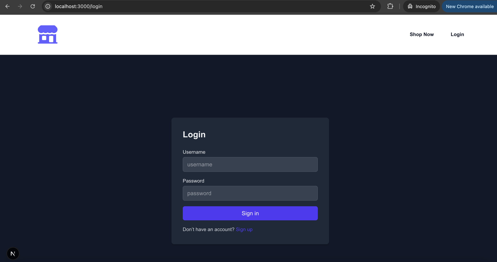
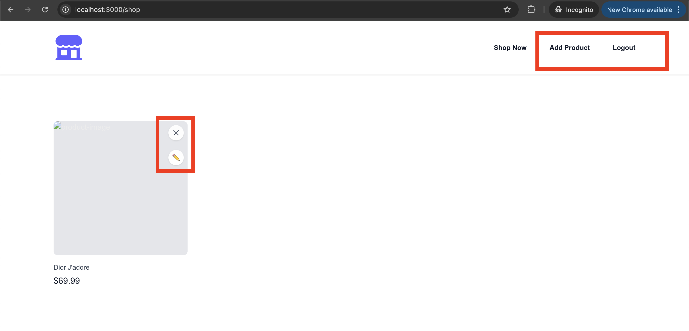
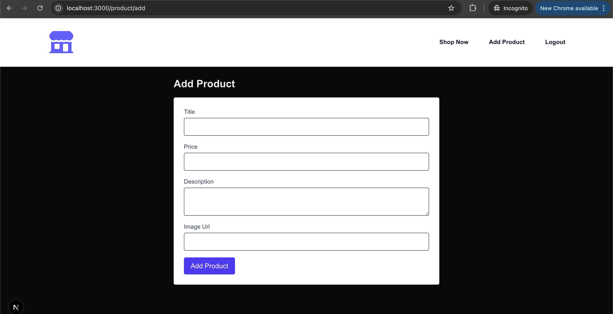
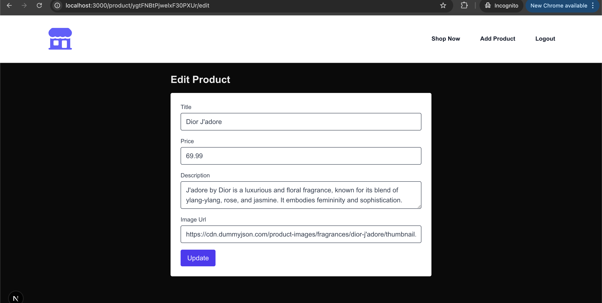
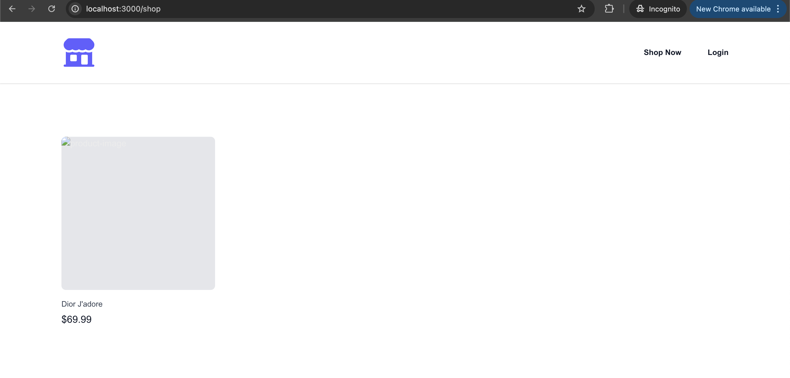

# Ecom-Admin-Dashboard

Description:An admin (or signed-in user) can manage a list of products.
Core Features:
* Auth system (register/login/logout).
* Product CRUD:
    * Add a product (name, price, description, image).
    * Edit / delete products.
    * View product list.
* Use Zod for validation.
* Protected routes for dashboard and CRUD pages.
* Public /shop page to list products for all visitors.
* Suspense while loading product lists.

# Login Page

# Product CRUD Feature For Admin ***

*** View ***

*** Add Product ***

*** Update Product ***

# Guest User Shop View
*** View ***

# Empty Product List View

